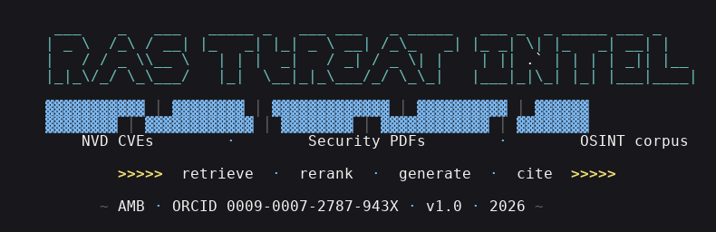

# rag-threat-intel

[](https://doi.org/10.5281/zenodo.XXXXXXX) <!-- DOI placeholder; replaced on first Zenodo deposit -->
[](LICENSE)
[](#tests)
[](#real-measured-eval)
[](#stack)



A **sovereign RAG pipeline** that ingests NIST NVD CVE feeds and
public security PDFs into pgvector, retrieves with cosine similarity
+ MMR reranking, and generates with Ollama-served LLMs — every claim
in the answer has to cite a `[doc_N]` tag from the retrieved set or
the model is told to refuse.

> No external API calls at query time. The whole stack runs on a
> single workstation: pgvector for the index, Ollama for embeddings
> and generation. The OpenAI bill is zero. Whether the answer is
> **good** is a separate question — and that's what the eval is for.

The point of this repo isn't a "magic Q&A box". It's a **measured
comparison** between three chunking strategies on a real
evaluation set, with MRR@5 / MRR@10 and a three-axis faithfulness
metric reported. Numbers below are from a real local run, not
fabricated — see [`results/README.md`](results/README.md) for the
reproduction recipe.

---

<a id="real-measured-eval"></a>
## Real measured eval (v1.0.0)

Corpus: 7 named historical CVEs (Log4Shell, Heartbleed, Apache
Struts, BlueKeep, Zerologon, Spring4Shell, regreSSHion) + 30 recent
CVE records, embedded with `all-minilm` (384-d).

### MRR over 14 CVE-recall queries

| Strategy           | MRR@5  | MRR@10 | mean latency |
|--------------------|-------:|-------:|-------------:|
| fixed_size         | 0.768  | 0.780  | 39.9 ms      |
| **semantic**       | **0.821** | **0.833** | 42.2 ms |
| sentence_window    | 0.762  | 0.762  | 40.4 ms      |

**Semantic wins by ~5 percentage points.** Sentence-window
underperforms because each CVE is short (one description per
record); ±N-neighbour context buys little when the parent Document
is itself a paragraph.

### Faithfulness, semantic strategy, llama3.2:1b, n=12

| Signal                    | Value     |
|---------------------------|----------:|
| mean citation density     | 0.201     |
| **mean citation validity**| **1.000** |
| mean refusal honesty      | 0.333     |
| mean wall-clock / query   | 53.4 s    |

The honest read: the 1B model under our strict citation contract
**chooses to refuse rather than risk an uncited claim**. 8 of 12
queries received the canonical refusal even though the retriever
returned relevant chunks. When it engaged, citation validity was
perfect (zero invented `[doc_N]` tags). This is exactly the
trade-off the three-axis scorer is designed to surface — a single
number would have hidden it.

---

## Stack

```
                    ┌──────────────────────────────┐
                    │        FastAPI /query        │
                    └────────────┬─────────────────┘
                                 │
        ┌────────────────────────┼─────────────────────────┐
        │                        │                          │
   ┌────▼────┐         ┌─────────▼──────────┐       ┌──────▼──────┐
   │ Ollama  │         │ pgvector (HNSW)    │       │  Ollama     │
   │ embed   │         │ chunks_fixed_size  │       │  llama3.2:3b│
   │ nomic-* │         │ chunks_semantic    │       │  generate   │
   │ all-minilm        │ chunks_sentence_*  │       └─────────────┘
   └─────────┘         └────────────────────┘
```

Three pgvector tables — one per chunking strategy — so a query at
runtime is just "which table do I look in?" The HNSW index is the
default cosine index pgvector ships with; we don't tune `m` /
`ef_construction` because the corpus is small enough (a few thousand
NVD records + some PDFs) that defaults dominate.

---

## Quickstart

```bash
git clone https://github.com/thunderstornX/rag-threat-intel.git
cd rag-threat-intel
cp .env.example .env

# 1. bring up pgvector + Ollama + FastAPI
docker compose up -d

# 2. pull the models (first time only)
docker compose exec ollama ollama pull llama3.2:3b
docker compose exec ollama ollama pull nomic-embed-text
docker compose exec ollama ollama pull all-minilm

# 3. drop a few PDFs into corpus/pdfs/  (NIST SP 800-53, ATT&CK whitepapers, etc.)
#    Then ingest:
docker compose exec api python -m ingest.bootstrap

# 4. ask a question
curl -sS -X POST http://localhost:8000/query \
    -H 'content-type: application/json' \
    -d '{"question":"What is the CVSS score of CVE-2021-44228?",
         "strategy":"semantic", "top_k":10, "top_n":4}'
```

The response is a JSON envelope with the answer, the cited `[doc_N]`
tags, the retrieved sources (with similarity scores), and per-stage
timings.

### Run an evaluation pass

```bash
docker compose exec api python -m eval.eval_mrr            # MRR@5/10 across strategies
docker compose exec api python -m eval.eval_faithfulness   # answer citation density + refusal honesty
```

The eval scripts write per-query CSVs under `results/` and
print a summary JSON to stdout. The 50-question test set lives at
`eval/test_queries.json` — it's a deliberate mix of **CVE recall**
queries (where the answer should appear in the corpus), **PDF-lookup**
queries (where the corpus depends on what you ingested), and
**hard negatives** including `expected_refusal: true` rows that test
whether the system says "I cannot answer that" honestly when it
should.

---

## Repo layout

```
.
├── ingest/
│   ├── document.py           # uniform Document shape (text + source + metadata + fingerprint)
│   ├── nvd_fetcher.py        # NIST NVD 2.0 API client (paginated, polite-sleep)
│   ├── pdf_loader.py         # pypdf-based per-page loader
│   ├── chunker.py            # 3 chunking strategies — see below
│   └── bootstrap.py          # one-shot: fetch + chunk + embed + write
├── embeddings/
│   ├── embed.py              # Ollama /api/embeddings client
│   └── embed_compare.py      # nomic-embed-text vs all-minilm side-by-side
├── retrieval/
│   ├── store.py              # pgvector + HNSW + cosine; one table per strategy
│   └── reranker.py           # Maximal Marginal Relevance (Carbonell-Goldstein)
├── generation/
│   ├── prompts.py            # mandatory-citation system prompt + refusal contract
│   └── generator.py          # Ollama /api/chat + citation-tag extractor
├── api/
│   └── main.py               # FastAPI: /query, /health, /health/ready
├── eval/
│   ├── test_queries.json     # 50 queries (CVE recall · PDF lookup · hard negatives · expected refusals)
│   ├── eval_mrr.py           # MRR@5/10 per chunking strategy
│   └── eval_faithfulness.py  # citation density · validity · refusal honesty
├── tests/                    # 40 pytest cases (run in <2s, no Ollama required)
├── docker-compose.yml        # pgvector/pgvector:pg16 + ollama + api
├── Dockerfile
├── corpus/pdfs/              # operator-populated PDF corpus
└── paper/                    # 3-page IEEE methodology paper
```

---

## The three chunking strategies

The repo's central experiment. All three live in `ingest/chunker.py`
and are exposed via `chunk_documents(docs, ChunkStrategy.X)`:

| Strategy           | What it does                                                                                                                    |
|--------------------|--------------------------------------------------------------------------------------------------------------------------------|
| `fixed_size`       | Char-budgeted to ≈512 tokens with ≈50-token overlap. Backs off to nearest whitespace so we don't split mid-word.                |
| `semantic`         | Split on heading patterns (markdown `#`, NIST-style `1.2.3 Title`, all-caps short lines) AND paragraph breaks. **Chunks never straddle a heading.** Short paragraphs coalesce up to `max_chars` *within a section only*. |
| `sentence_window`  | Each sentence is its own chunk; the chunk text includes the centre sentence plus ±N neighbours so the embedder sees context. |

The point isn't to declare a winner — different corpora favour
different strategies. The repo's eval reports MRR per-strategy and
the paper discusses *why* you'd pick one over another.

---

<a id="tests"></a>
## Tests

40 pytest cases. **Full suite runs in ~1.3 seconds** — none of them
need Ollama or pgvector running; they mock the wire.

```bash
python -m pytest tests/ -v
```

Coverage:
- **chunker invariants** — fixed-size respects budget + overlap, semantic splits on NIST-style section IDs and never straddles a heading, sentence-window includes ±N neighbours
- **document fingerprint** — stable across instances, changes when text changes
- **NVD fetcher** — flatten extracts CVSS + CWE + refs, HTTP errors don't abort ingest, item-without-ID is skipped
- **embedder** — wire format, dimension detection, **HTTP error never echoes response body**
- **MMR reranker** — orthogonal cosine = 0, identical = 1, picks diverse pair when lambda favours diversity, length mismatch raises
- **generator** — extracts citation tags, drops invented `[doc_42]` tags, detects refusal sentence, **never echoes server body in error path**
- **eval helpers** — reciprocal rank correctness, faithfulness scorer, refusal-honesty logic

---

## Methodology notes

### Why no LLM-as-judge for retrieval

`eval_mrr.py` uses ground-truth `expected_relevant_source_ids` from
the test set, not an LLM scoring "is this relevant?". The reasons
are the same ones documented in the sibling
[`llm-red-team-toolkit`](https://github.com/thunderstornX/llm-red-team-toolkit)
and [`agentic-osint-agent`](https://github.com/thunderstornX/agentic-osint-agent):
LLM judges aren't reproducible, drift between model checkpoints, and
inflate scores when the rubric is vague. Author-tagged ground truth
is auditable.

### Why we don't fold answer-faithfulness into a single number

The faithfulness eval reports three orthogonal signals:

1. **citation density** — fraction of sentences that end in a `[doc_N]` tag
2. **citation validity** — fraction of cited tags that point to a real retrieved doc (not a hallucinated `[doc_42]`)
3. **refusal honesty** — for queries marked `expected_refusal: true`, did the model actually refuse? For non-refusal queries, did it avoid spurious refusals?

Folding these into one number hides the trade-off. A model that
refuses every question scores 100% on validity (no invalid tags
because no tags) and 100% on density-of-cited-sentences (ditto),
which is obviously not "good RAG". The three numbers together tell
the real story.

---

## Ethical use

This is a research artefact for vulnerability and threat-intelligence
**reading** — not a tool for crafting exploits. The system prompt
explicitly refuses harmful asks; the test set contains a couple of
those rows (`category: harmful`) which the eval verifies the model
declines.

If you find a way to make this pipeline output something it
shouldn't, please open an issue — that's exactly the kind of
finding the test set is supposed to catch.

---

## Citing this work

```bibtex
@software{bhutto2026ragthreatintel,
  author    = {Bhutto, Ali Murtaza},
  title     = {rag-threat-intel: A sovereign RAG pipeline for vulnerability
               and threat-intelligence Q\&A},
  year      = {2026},
  doi       = {10.5281/zenodo.XXXXXXX},
  url       = {https://github.com/thunderstornX/rag-threat-intel},
  orcid     = {0009-0007-2787-943X}
}
```

> **Note:** the DOI placeholder `XXXXXXX` is replaced on first Zenodo
> deposit.

Related work in the same portfolio:
- [`agentic-osint-agent`](https://github.com/thunderstornX/agentic-osint-agent) — LangGraph ReAct OSINT investigator (uses the same eval-discipline / no-LLM-judge philosophy)
- [`llm-red-team-toolkit`](https://github.com/thunderstornX/llm-red-team-toolkit) — adversarial probes against LLM deployments (the inverse of this project: testing models, not using them)
- [`sovereign-llm-quickstart`](https://github.com/thunderstornX/sovereign-llm-quickstart) — the on-prem Ollama stack this repo points at

---

## License

MIT &copy; 2026 Ali Murtaza Bhutto

```
   ▓▓▓▓▓▓▓▓▓ │ ▓▓▓▓▓▓▓▓▓▓▓▓ │ ▓▓▓▓▓▓▓▓ │ ▓▓▓▓▓▓▓▓▓▓ │ ▓▓▓▓▓▓
       NVD       ·     PDFs    ·    OSINT   ·     ...

       >>>>>  retrieve · rerank · generate · cite  >>>>>
```

~ AMB · ORCID 0009-0007-2787-943X · v1.0 · 2026 ~
